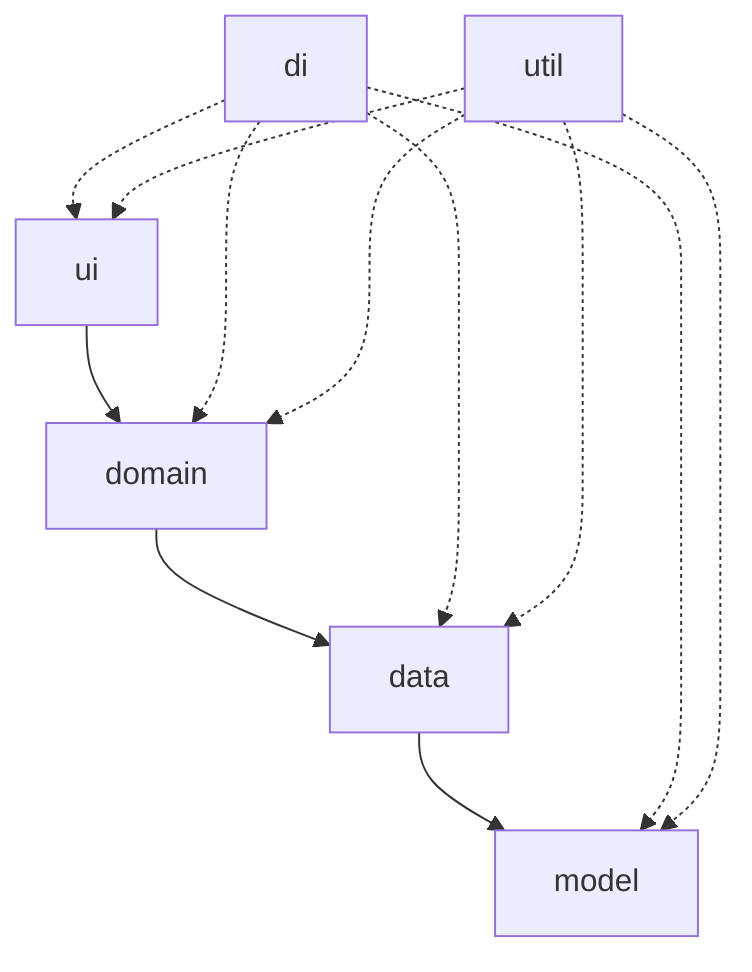

# Архитектурная схема приложения

## Пакеты и их ответственность

| Пакет | Основная роль | Типичные компоненты |
|-------|---------------|----------------------|
| `ui` | Отвечает за отображение, обработку пользовательского ввода и связывание интерфейса с моделью представления. | Activity, Fragment, адаптеры, компоненты интерфейса. |
| `domain` | Инкапсулирует бизнес-правила, сценарии использования и интерфейсы, не зависящие от платформы. | UseCase, Interactor, интерфейсы репозиториев и движков. |
| `data` | Реализует доступ к данным и инфраструктуру, преобразуя источники данных в формат, понятный домену. | Реализации Repository, DataSource, мапперы, кэш. |
| `model` | Содержит сущности предметной области и DTO, которыми обмениваются уровни приложения. | DomainModel, DataModel, сущности API. |
| `di` | Конфигурирует граф зависимостей и их жизненный цикл. | Модули DI, провайдеры, фабрики. |
| `util` | Содержит общие вспомогательные компоненты, не привязанные к конкретному уровню. | Логирование, расширения, валидаторы, константы. |

## Ответственность ключевых классов

| Класс | Расположение | Ответственность |
|-------|--------------|------------------|
| `Activity` | `ui` | Инициализирует и отображает экран, подписывается на состояние `ViewModel`, перенаправляет события пользователя в доменный слой. |
| `ViewModel` | `ui` / `domain` | Управляет состоянием интерфейса, запрашивает данные из `domain`, обрабатывает результаты и подготавливает их для отображения. |
| `Engine` | `domain` | Реализует бизнес-правила игры (например, вычисление победителя), предоставляет чистые функции и сценарии использования. |
| `Repository` | `data` | Инкапсулирует источники данных, агрегирует ответы клиента и локальных хранилищ, предоставляет унифицированный API для домена. |
| `Client` | `data` | Отвечает за сетевое или аппаратное взаимодействие (запросы к API, доступ к модели распознавания), преобразует внешние данные в модели `data`. |

## Зависимости между пакетами

- `ui` зависит от `domain` через интерфейсы сценариев использования и модели представления.
- `domain` зависит от `data` только через абстракции (интерфейсы репозиториев и движков).
- `data` использует `model` для преобразования внешних данных и реализации протоколов обмена.
- `di` связывает реализации и интерфейсы между всеми слоями, но сами пакеты не зависят от `di`.
- `util` доступен как вспомогательный пакет для всех остальных уровней.

## Диаграмма зависимостей

## Архитектурные паттерны

### Clean Architecture

- **Разделение слоёв.** Структура проекта наследует принципы Clean Architecture: доменный слой (`domain`, `model`) изолирован от инфраструктурных подробностей (`data`, `di`, `util`), что позволяет тестировать бизнес-правила без Android/HTTP окружения и переиспользовать их в других клиентах.
- **Контракты вместо реализаций.** Доменный слой оперирует интерфейсами (`Repository`, `EngineGateway`), а конкретные реализации размещаются в `data`. Благодаря этому можно подменять источники данных (сетевые клиенты, офлайн-кэш) без изменения сценариев использования.
- **Внешние круги зависят от внутренних.** Пакет `ui` получает доступ к сценариям использования через адаптеры ViewModel, в то время как `data` реализует необходимые порты и возвращает доменные сущности. DI-слой связывает зависимости на периферии, не нарушая границы.
- **Тестируемость.** Автотесты для `domain` и `data` используют заглушки интерфейсов, что ускоряет регрессионное тестирование и уменьшает зависимость от инфраструктуры.

### MVVM на уровне presentation

- **Model (ViewState/Domain Models).** ViewModel экспонирует неизменяемые `ViewState`/`UiModel`, собранные из доменных сущностей. Это упрощает связывание с XML/Compose и предотвращает логические ошибки в Activity.
- **ViewModel.** Каждый экран имеет собственную ViewModel, которая подписывается на `UseCase`, преобразует доменные результаты в состояние UI и управляет сайд-эффектами (навигация, всплывающие сообщения).
- **View.** Activity/Fragment отвечают только за отображение состояния и делегирование действий пользователя в ViewModel. Такая изоляция делает слой представления переиспользуемым и готовым к unit/UI тестам.
- **Связь с Clean Architecture.** ViewModel служит адаптером между `ui` и `domain`, реализуя границу слоёв. Навигация и DI инжектят только абстракции, сохраняя слабую связанность.

## Технологический стек мобильного клиента

- **Платформа:** Android SDK с использованием Java в качестве основного языка разработки. Такое решение обеспечивает совместимость с существующим стеком проекта и упрощает интеграцию с библиотеками, требующими Java API.
- **UI-фреймворк:** Android Jetpack с компонентами ViewModel и LiveData для реактивного управления состоянием экранов.
- **Хранилище и синхронизация:** Room применяется для кэширования данных игры локально, а WorkManager отвечает за отложенную синхронизацию ходов и статистики при нестабильном соединении.
- **Навигация и маршрутизация:** Navigation Component управляет переходами между экранами приложения и гарантирует единый стек навигации.
- **Внедрение зависимостей:** Hilt обеспечивает конфигурацию графа зависимостей и интеграцию с жизненным циклом Android-компонентов.

## Роли ключевых Jetpack-компонентов

| Компонент | Пакет | Роль в приложении |
|-----------|-------|-------------------|
| `ViewModel` | `ui` | Хранит и подготавливает состояние экрана, инкапсулируя бизнес-логику взаимодействия между пользовательским интерфейсом и доменным слоем. Обеспечивает переживание изменений конфигурации. |
| `LiveData` | `ui` | Поставляет реактивные обновления интерфейсу, подписывая `Activity` и `Fragment` на изменение состояния, передаваемого из `ViewModel`. |
| `Room` | `data` | Обеспечивает типобезопасный доступ к локальной базе данных, кэшируя сущности домена и позволяя работать офлайн. |
| `WorkManager` | `data` / `util` | Планирует и выполняет отложенные или повторяющиеся задания, такие как синхронизация статистики и загрузка медиа. |
| `Navigation` | `ui` | Управляет графом экранов, облегчает передачу аргументов между ними и восстанавливает стек навигации. |
| `Hilt` | `di` | Настраивает внедрение зависимостей, связывает реализации репозиториев и сценариев использования с жизненным циклом Android-компонентов. |

## Таблица соответствия уровням архитектуры

| Уровень | Основные пакеты | Комментарии |
|---------|-----------------|-------------|
| Представление | `ui`, `util` | Работает с состоянием экранов и пользовательским вводом. |
| Домен | `domain`, `model` | Содержит правила игры, сущности и интерфейсы. |
| Данные | `data`, `model` | Реализации репозиториев, клиентов и преобразователей данных. |
| Инфраструктура | `di`, `util` | Настраивает зависимости, предоставляет общие сервисы и утилиты. |

