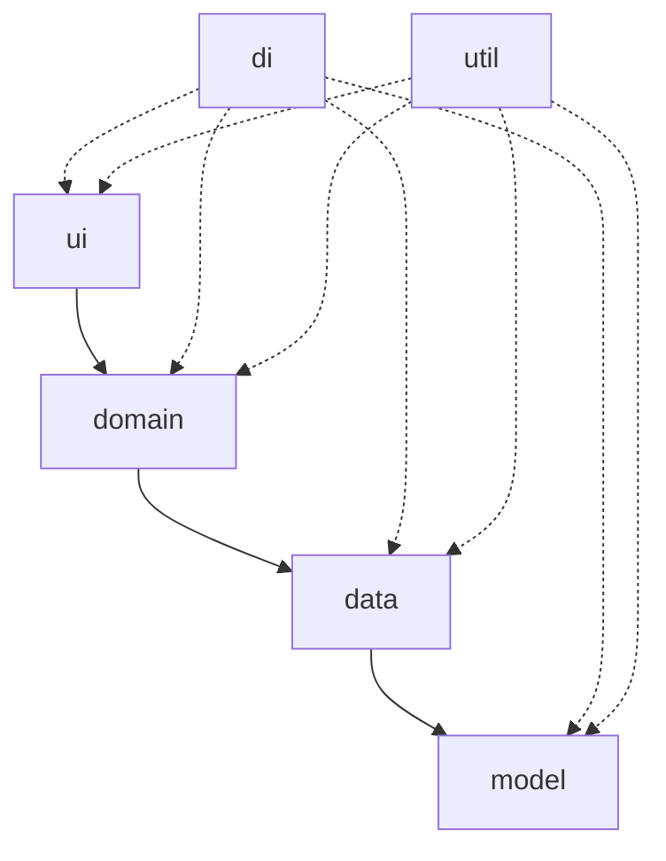

# Архитектурная схема приложения

## Пакеты и их ответственность

| Пакет | Основная роль | Типичные компоненты |
|-------|---------------|----------------------|
| `ui` | Отвечает за отображение, обработку пользовательского ввода и связывание интерфейса с моделью представления. | Activity, Fragment, адаптеры, компоненты интерфейса. |
| `domain` | Инкапсулирует бизнес-правила, сценарии использования и интерфейсы, не зависящие от платформы. | UseCase, Interactor, интерфейсы репозиториев и движков. |
| `data` | Реализует доступ к данным и инфраструктуру, преобразуя источники данных в формат, понятный домену. | Реализации Repository, DataSource, мапперы, кэш. |
| `model` | Содержит сущности предметной области и DTO, которыми обмениваются уровни приложения. | DomainModel, DataModel, сущности API. |
| `di` | Конфигурирует граф зависимостей и их жизненный цикл. | Модули DI, провайдеры, фабрики. |
| `util` | Содержит общие вспомогательные компоненты, не привязанные к конкретному уровню. | Логирование, расширения, валидаторы, константы. |

## Ответственность ключевых классов

| Класс | Расположение | Ответственность |
|-------|--------------|------------------|
| `Activity` | `ui` | Инициализирует и отображает экран, подписывается на состояние `ViewModel`, перенаправляет события пользователя в доменный слой. |
| `ViewModel` | `ui` / `domain` | Управляет состоянием интерфейса, запрашивает данные из `domain`, обрабатывает результаты и подготавливает их для отображения. |
| `Engine` | `domain` | Реализует бизнес-правила игры (например, вычисление победителя), предоставляет чистые функции и сценарии использования. |
| `Repository` | `data` | Инкапсулирует источники данных, агрегирует ответы клиента и локальных хранилищ, предоставляет унифицированный API для домена. |
| `Client` | `data` | Отвечает за сетевое или аппаратное взаимодействие (запросы к API, доступ к модели распознавания), преобразует внешние данные в модели `data`. |

## Зависимости между пакетами

- `ui` зависит от `domain` через интерфейсы сценариев использования и модели представления.
- `domain` зависит от `data` только через абстракции (интерфейсы репозиториев и движков).
- `data` использует `model` для преобразования внешних данных и реализации протоколов обмена.
- `di` связывает реализации и интерфейсы между всеми слоями, но сами пакеты не зависят от `di`.
- `util` доступен как вспомогательный пакет для всех остальных уровней.

## Диаграмма зависимостей

## Таблица соответствия уровням архитектуры

| Уровень | Основные пакеты | Комментарии |
|---------|-----------------|-------------|
| Представление | `ui`, `util` | Работает с состоянием экранов и пользовательским вводом. |
| Домен | `domain`, `model` | Содержит правила игры, сущности и интерфейсы. |
| Данные | `data`, `model` | Реализации репозиториев, клиентов и преобразователей данных. |
| Инфраструктура | `di`, `util` | Настраивает зависимости, предоставляет общие сервисы и утилиты. |

